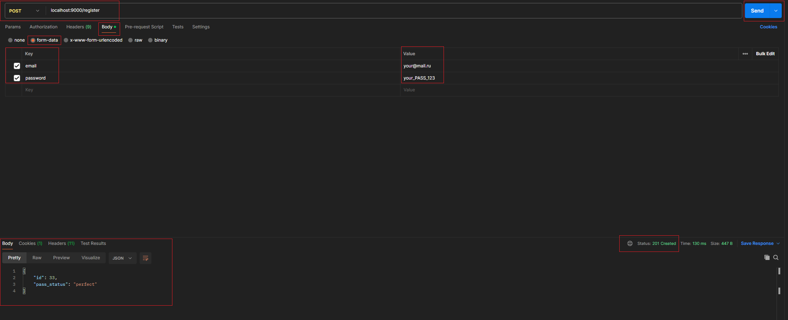
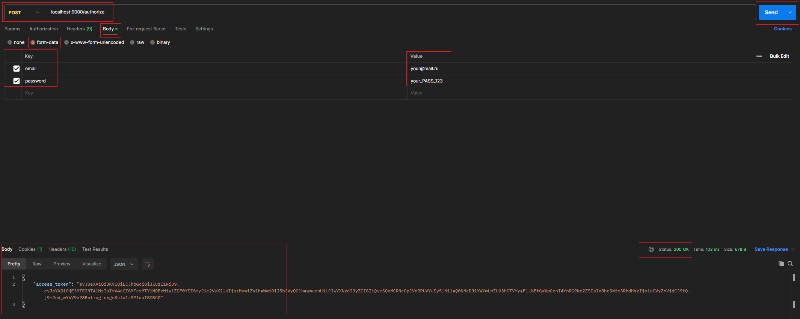
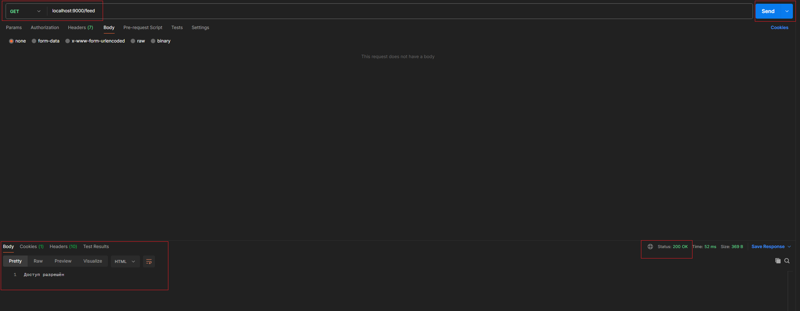
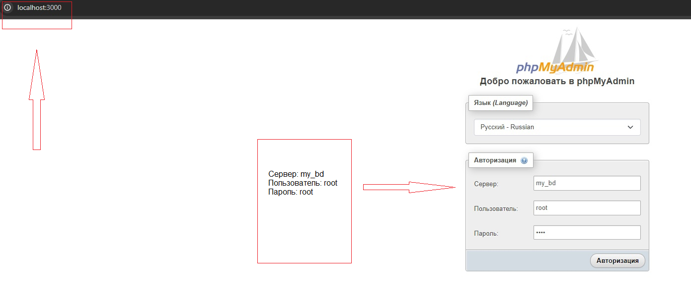
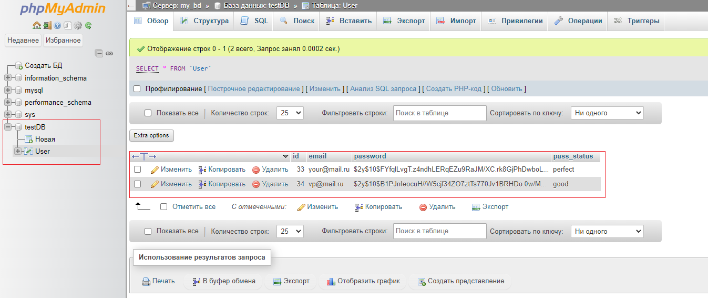

# Упрощенный сервис с регистрацией и авторизацией

## Инструкция по запуску:
1. В локальной директории из терминала выполняем команду: 

    `git clone https://github.com/vladislavpetrov4311/vk-test.git`
2. В этой же директории из терминала запускаем: 

    `docker-compose up`

## Пример работы в Postman

### 1. /register

#### `Это задание в исходниках см. файлы: register.php и Register_class.php`

### 2. /authorize

#### `Это задание в исходниках см. файлы: authorize.php и Authorize_class.php`

### 3. /feed

#### `Это задание в исходниках см. файл: feed.php`

### На случай, если нужно просмотреть визуально Базу Данных 

1. Переходим по localhost:3000 

    `!!! Важно !!! Обратите внимание, при самом первом запуске образ mysql из docker-контейнера требует немного больше времени на развёртывание, поэтому после запуска приложения нужно будет немного подождать`

    

2. База данных testDB, таблица User

    

## Мои контакты

#### `1. E-mail: petrov_vd_4311@mail.ru`
#### `2. номер телефона + 7 953 495 88 73`
